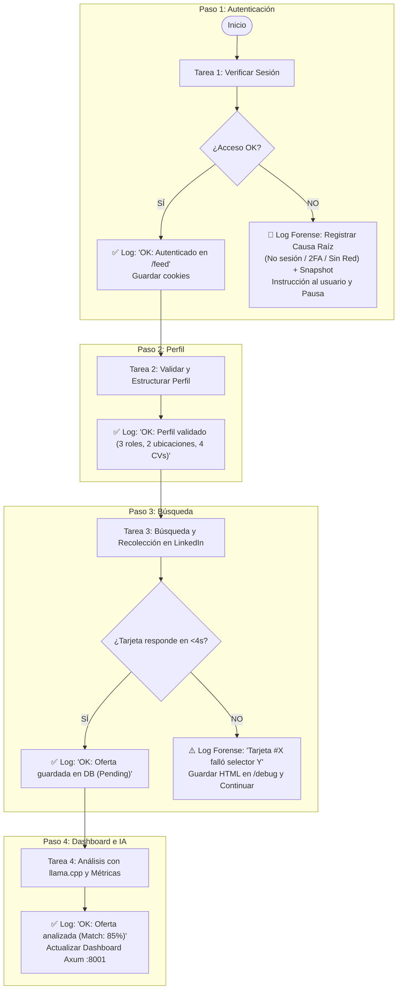

# 🦀 TalentFlow — Arquitectura, Flujo y Plan Maestro (100% Rust)

> **Directiva Fundamental:** El sistema debe ser **100% Rust Nativo** (cero dependencias de Python). Todas las funcionalidades se ejecutan bajo el binario nativo `talentflow`. Se elimina **Steel Wasp** y se conecta la IA local directamente mediante **`llama.cpp`** (`llama-server` en C++, saltándose Ollama) con fallback a **Gemini API**.

---

## 📜 1. Sistema de Auditoría Forense y Registro de Incidentes (Post-Mortem)

Para garantizar la **mejora continua** y evitar que el sistema vuelva a tropezar con el mismo problema, **cada paso y subtarea genera un registro de auditoría estructurado** (`logs/audit.jsonl` y consola/Dashboard).

### 🎯 Objetivos de la Auditoría:
1. **Confirmación de Éxito:** Registrar exactamente cuándo y cómo se completó una tarea (ej. `"OK: Autenticación exitosa vía cookies de Chrome"`).
2. **Registro Forense de Incidentes:** Si una tarea falla, se bloquea o detecta una anomalía, el sistema **no oculta el error ni se queda en bucle**; captura la evidencia completa para que el desarrollador pueda auditar el código y corregirlo definitivamente:
   * **URL exacta y Título de la página.**
   * **Selector CSS / Elemento HTML que falló.**
   * **Snapshot del DOM** guardado en `debug/dom/incidente_<timestamp>.html`.
   * **Captura de pantalla (Screenshot)** guardada en `debug/screenshots/incidente_<timestamp>.png`.
   * **Causa Raíz Diagnosticada y Sugerencia de Corrección.**

### 📝 Estructura del Log de Auditoría (`logs/audit.jsonl`):
```json
{
  "timestamp": "2026-08-19T08:12:00Z",
  "step": "PASO_1_LOGIN",
  "subtask": "Verificar sesión en /feed",
  "result": "BLOCKED",
  "reason": "LINKEDIN_CHECKPOINT_2FA",
  "details": "Redirigido a https://www.linkedin.com/checkpoint/challenge/...",
  "artifacts": {
    "dom_dump": "debug/dom/checkpoint_20260819_081200.html",
    "screenshot": "debug/screenshots/checkpoint_20260819_081200.png"
  },
  "action_taken": "Pausa limpia. Se solicitó autenticación manual al usuario.",
  "developer_note": "Ajustar selector de checkpoint o esperar resolución de 2FA por el usuario."
}
```

---

## 🧭 2. Flujo de Trabajo Organizado con Auditoría en Cada Paso



---

## 📋 3. Detalle de Tareas y Auditoría por Cada Paso

### 🔑 Paso 1: Login y Autenticación
* **Subtarea 1.1:** Intento de acceso con cookies/perfil persistente.
  * *Si éxito:* Log `OK: Sesión activa válida`. Avanza al Paso 2.
  * *Si falla:* Log Forense `FAIL: Motivo exacto (Sin sesión / Checkpoint / Red caída)`. Guarda captura y notifica al usuario con el comando `talentflow login`.

---

### 👤 Paso 2: Extraer Perfil y Organizarlo
* **Subtarea 2.1:** Carga de `config/profile_config.json` y `config/cv_profile.json`.
* **Subtarea 2.2:** Verificación de campos obligatorios y matriz de CVs en `cv/`.
  * *Si éxito:* Log `OK: Perfil cargado (Roles: [Backend, Architect], CVs: 4 archivos vinculados)`.
  * *Si falta algún archivo:* Log Forense `WARNING: No se encontró el CV 'CV_20_M_D_P_ES.pdf'. Usando CV genérico`.

---

### 🔍 Paso 3: Buscar las Ofertas en LinkedIn
* **Subtarea 3.1:** Navegación por combinaciones de búsqueda (Rol $\times$ Ubicación).
* **Subtarea 3.2:** Extracción por tarjeta de empleo con timeout estricto (4s).
  * *Si éxito:* Log `OK: Vacante [TechCorp - Backend Senior] insertada en talentflow.db`.
  * *Si falla selector:* Log Forense `INCIDENT: Selector de descripción cambió en oferta URL_XYZ`. Guarda el fragmento HTML en `debug/dom/` para que el desarrollador actualice el selector CSS, y salta a la siguiente oferta sin bloquear el proceso.

---

### 📊 Paso 4: Actualizar el Dashboard
* **Subtarea 4.1:** Evaluación con IA local (`llama.cpp` / `llama-server` en C++ o Gemini).
  * *Si éxito:* Log `OK: Análisis completado en 1.2s. Match: 88%, Status: Matched`.
  * *Si timeout LLM (>15s):* Log Forense `WARNING: llama.cpp timeout. Activado motor heurístico regex`.
* **Subtarea 4.2:** Emisión de eventos WebSockets / SSE al Dashboard Svelte en el puerto `:8001`.
* **Subtarea 4.3:** Guardado de estadísticas en `talentflow.db` (SQLite WAL).

---

## 🛠️ 4. Beneficios para la Auditoría y Mantenimiento del Código

| Situación | Comportamiento sin Auditoría (Anterior) | Comportamiento con Sistema de Auditoría (Nuevo) |
| :--- | :--- | :--- |
| LinkedIn cambia el botón de "Siguiente" | El bot se queda esperando en un bucle infinito ("pegado"). | Falla a los 4s, guarda el HTML exacto del botón en `debug/dom/`, registra el selector fallido en el log y continúa con la siguiente vacante. |
| La sesión de LinkedIn se vence a mitad de búsqueda | El bot intenta navegar pantallas de error una y otra vez. | Detecta `/login`, registra `SESSION_EXPIRED`, avisa al Dashboard y se detiene limpiamente. |
| El modelo LLM devuelve un JSON malformado | El proceso colapsa con error de parseo no controlado. | El normalizador rescata los campos, registra `SCHEMA_RESCUE` en el log con el JSON crudo y no interrumpe el flujo. |
