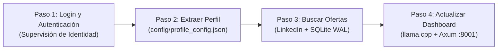

# 🧠 TalentFlow — Especificación Técnica y Arquitectura (100% Rust Nativo)

> **Regla de Oro del Proyecto:**
> Este proyecto está **100% migrado a Rust Nativo (`cargo`)**.
> **NO se utiliza Python** para la ejecución, automatización ni backend del sistema. Quedan terminantemente prohibidos los comandos tipo `python`, `.venv`, `pip` o librerías viejas de Python en los workflows de producción.
> *(Nota: El único autorizado para generar scripts efímeros de apoyo en Python es el agente de Gemini cuando actúa de forma independiente para tareas analíticas).*

---

## 🏗️ 1. Arquitectura del Sistema

TalentFlow opera como un único binario nativo en Rust (`talentflow`) de alto rendimiento y cero bloqueos.

### Componentes Principales:
1. **Navegador y Automatización:** Chromiumoxide (CDP Nativo) ejecutando Chrome en **Modo Humano Puro** (sin banderas de bot ni `--enable-automation`).
2. **Motor de IA Local:** `llama.cpp` (`llama-server` en C++ vía HTTP REST en `http://localhost:8080`), consumiendo modelos `.gguf` directamente sin intermediarios (sin Ollama ni Steel Wasp).
3. **Motor de IA Cloud (Opcional):** Gemini API directa vía REST.
4. **Base de Datos:** SQLite nativo (`rusqlite`) con **WAL (Write-Ahead Logging)** para lectura y escritura paralela sin bloqueos.
5. **Dashboard Backend:** Servidor web nativo en Rust (**Axum**) en el puerto `8001`.
6. **Dashboard Frontend:** Interfaz reactiva en SvelteKit / assets compilados.

---

## 🧭 2. Los 4 Pasos Organizados del Sistema



### 🔑 Paso 1: Login y Autenticación
* Utiliza la sesión persistente de Chrome (`user_data_safe`).
* **Patrón Acción ➔ Supervisor:** Entra a `/feed/`, visita `/in/me/`, valida el nombre del usuario (`Jesus Coronado`) y registra el éxito en `logs/audit.jsonl`.
* **Fast-Fail:** Si la sesión expiró o pide 2FA, corta en menos de 10 segundos, no hace bucles infinitos y notifica al usuario.
* **Comando:** `cargo run -- step1-auth --profile user_data_safe`

### 👤 Paso 2: Extraer Perfil y Organizarlo
* Carga `config/profile_config.json` y `config/cv_profile.json`.
* Valida campos salariales, matriz de CVs (`cv/`) y roles objetivo (`target_roles`).

### 🔍 Paso 3: Buscar las Ofertas en LinkedIn
* Recolecta ofertas cruzando Rol $\times$ Ubicación.
* Extrae título, empresa, tipo de postulación y requisitos completos.
* Guarda en `talentflow.db` con estado inicial `Pending` y deduplicación por URL.

### 📊 Paso 4: Actualizar el Dashboard
* Envía la oferta a `llama.cpp` para calcular `match_score` (0 a 100%) y clasificar en `Matched` o `Discarded`.
* El servidor Axum (`:8001`) transmite las métricas en vivo al Dashboard Svelte.
* Habilita el Apply Bot (`cargo run -- apply [--dry-run]`).

---

## 📜 3. Sistema de Auditoría Forense (`logs/audit.jsonl`)

Cada paso genera un registro forense JSON estructurado con:
* `step` y `subtask`: Qué tarea se ejecutó.
* `result` (`OK` o `FAIL`) y `reason` exacta.
* `artifacts`: Rutas a volcados HTML (`debug/dom/`) y capturas (`debug/screenshots/`) en caso de anomalía.
* `action_taken` y `developer_note`: Instrucción exacta para auditar y reparar el código.

---

## 🚀 4. Comandos Oficiales de Ejecución

```bash
# 1. Limpieza de procesos y bloqueos
rm -f user_data*/SingletonLock && pkill -9 -f chrome || true

# 2. Verificar autenticación (Paso 1)
cargo run -- step1-auth --profile user_data_safe

# 3. Iniciar sesión asistida (si expiró)
cargo run -- login --profile user_data_safe

# 4. Iniciar Dashboard en vivo
cargo run -- dashboard

# 5. Ver estadísticas de la base de datos
cargo run -- stats

# 6. Ejecutar Apply Bot
cargo run -- apply --dry-run   # Auditoría sin enviar
cargo run -- apply             # Envío real
```
